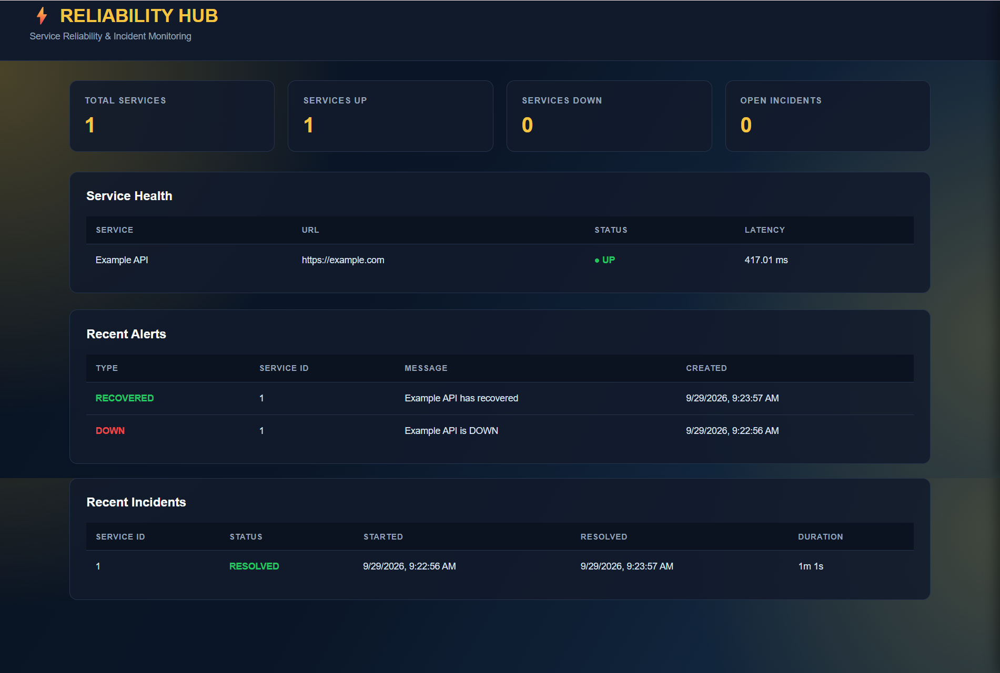

# Service Reliability & Incident Monitoring Platform

A lightweight service monitoring platform that continuously checks APIs and services for availability, response latency, failures, incidents, and recovery.

The platform provides a FastAPI backend, automated monitoring, incident lifecycle management, alert generation, historical monitoring data, and a React-based web dashboard.

---

## Tech Stack

- **Frontend:** React
- **Backend:** Python, FastAPI
- **Database:** PostgreSQL
- **ORM:** SQLAlchemy
- **HTTP Monitoring:** HTTPX
- **Testing:** pytest
- **Deployment:** Docker

## Overview

The platform monitors registered services and records their health over time.

Each monitoring cycle checks the configured service and records:

- Service availability
- HTTP status code
- Response latency
- Failure reason
- Monitoring timestamp

When a service becomes unavailable, the system automatically:

- Detects the failure
- Records the monitoring result
- Creates an incident
- Generates a DOWN alert

When the service recovers, the system:

- Detects the recovery
- Resolves the open incident
- Records the incident duration
- Generates a RECOVERED alert

The project also provides a React-based web dashboard for viewing service health, incidents, alerts, and reliability information.

---

## Dashboard



---

## Architecture

```text
                    ┌─────────────────────────┐
                    │       Web Browser       │
                    │      React Dashboard    │
                    └────────────┬────────────┘
                                 │
                                 ▼
                    ┌─────────────────────────┐
                    │       FastAPI API       │
                    └────────────┬────────────┘
                                 │
              ┌──────────────────┼──────────────────┐
              │                  │                  │
              ▼                  ▼                  ▼
       ┌───────────────┐  ┌───────────────┐  ┌───────────────┐
       │   Monitoring  │  │  PostgreSQL   │  │   REST API    │
       │     Engine    │  │    Database   │  │   Endpoints   │
       └───────┬───────┘  └───────────────┘  └───────────────┘
               │
               ▼
          ┌─────────┐
          │  HTTPX  │
          └────┬────┘
               │
               ▼
        External Services